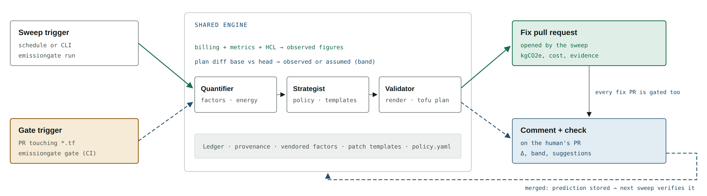

# EmissionGate

**Carbon at merge time.** An agent that puts the carbon cost of cloud and AI infrastructure into the pull
request: it finds waste in running infrastructure and drafts the fix as a PR, and it checks every
infrastructure PR before merge and posts its kgCO2e delta with validated lower-carbon suggestions.
Humans decide; the agent cannot apply, merge or delete anything.

> **Demo video (4 min, agent running):** TODO-VIDEO-LINK
>
> **Live gate example:** TODO-GATE-PR-LINK (a PR adding 2 × g5.2xlarge, with the gate's comment)
>
> All data is **synthetic** or public. No customer, confidential or personal data is used.
> *Prompt, Plan, Preserve* hackathon — Green IT (Green AI / carbon accounting).

| Deliverable | Where |
|---|---|
| Agent design document (architecture, decision points, oversight, failure handling) | [docs/AGENT_DESIGN.md](docs/AGENT_DESIGN.md) |
| Pitch deck (10 slides) | [docs/EmissionGate-pitch.pdf](docs/EmissionGate-pitch.pdf) · [.pptx](docs/EmissionGate-pitch.pptx) |
| Augmentation log (AI usage across the lifecycle) | [docs/augmentation-log.md](docs/augmentation-log.md) |
| Demo video | link above |

**Built with:** Claude Code (all code in this repository) and Claude (design and documents). Codex licences
arrived late in the hackathon; Codex built and checked an early scaffold prototype, then the submission was
built with Claude Code. Details: [augmentation log](docs/augmentation-log.md) ·
[ADR-0016](docs/adr/0016-claude-code-builds-submission.md).

## The problem

Infrastructure emissions are committed when infrastructure code merges, but nobody sees carbon at that
moment. Cloud carbon reports arrive monthly, by region, never per resource or per change. An idle GPU
fleet burns electricity for months before anyone connects it to a decision, and cost-ranked tools
prioritise a different list from carbon-ranked ones.

## Two modes, one engine



- **Sweep** — reads billing, utilisation and Terraform, computes kWh and kgCO2e per resource, refuses
  anything a guardrail protects, ranks the rest by carbon, renders a fix from a fixed set of templates,
  proves it with `tofu plan`, and drafts a pull request with the numbers and evidence.
- **Gate** — on every PR that changes `*.tf`, plans base and head, computes the carbon delta per resource
  and posts one comment with lower-carbon suggestions that are themselves proven to plan. Above
  100 kgCO2e/yr the check fails until a human commits a suggestion or acknowledges the increase with a
  reason. Spec: [docs/GATE.md](docs/GATE.md).

## Setup

Runs on Linux, macOS or **Windows via WSL2 (Ubuntu 24.04)**. Nothing is deployed and no cloud account is
needed.

| Need | Version | Install |
|---|---|---|
| Python | 3.12+ | Ubuntu 24.04: `sudo apt install python3-venv python3-pip` |
| make, git | any | `sudo apt install make git` |
| OpenTofu | 1.8+ | [opentofu.org/docs/intro/install](https://opentofu.org/docs/intro/install/) |
| Ollama + `gpt-oss:20b` | optional, for the LLM tier | [ollama.com](https://ollama.com); about 14 GB, needs ~16 GB free RAM |

```bash
git clone https://github.com/MohdJaved01/emissiongate && cd emissiongate
make setup        # virtualenv, dependencies, .env from .env.example
make providers    # downloads the AWS provider once into .tofu-providers/ — the only networked step
```

## Run

```bash
make demo-offline   # generate the synthetic estate (seed 42) and run the sweep — no LLM, no keys
make score          # precision, recall and trap violations against the seeded ground truth
```

Open `runs/<run_id>/report.html`. Then, optionally, with the local model:

```bash
ollama pull gpt-oss:20b
make demo           # same pipeline; the model chooses parameters and writes PR narrative
```

**The gate.** See it on GitHub at the live example linked above, or run it locally against the demo
estate:

```bash
git clone https://github.com/MohdJaved01/emissiongate-demo-estate ../estate
.venv/bin/emissiongate gate --estate-dir ../estate --base main --head origin/demo/add-gpu-fleet
```

It prints the comment the PR would get. In the estate repo, `.github/workflows/emissiongate-gate.yml`
runs the same command on every pull request and posts the comment.

### What you will see

| Output | Content |
|---|---|
| `runs/<id>/report.html` | per-resource kgCO2e with provenance, carbon vs cost ranking, refused and advisory items with reasons, PR drafts, the agent's own energy and kgCO2e |
| `runs/<id>/prs/*.md` | each PR body as it would appear on GitHub |
| `runs/<id>/ledger.sqlite` | every state transition, tool call and LLM call with tokens and timings |
| gate comment | net kgCO2e/yr per changed resource, assumption range, suggestions, check status |

## Sample data

`make estate` (run by `make demo-offline`) generates everything from `--seed 42`; the same seed gives
byte-identical files. Generated files are not committed — they appear in `data/` and `.estate/`.

| Data | Content |
|---|---|
| Billing | CUR-shaped parquet, hourly, 35 days, synthetic prices |
| Utilisation | hourly CPU, GPU and memory per resource |
| Terraform | 10 resource groups, one `.tf` file each, dummy credentials, plans offline |
| Ground truth | the expected decision for each resource, used by `make score` |

The estate contains real-looking waste — an idle staging GPU fleet, an always-on dev API, x86 workers
that could run on Graviton, an oversized database, an unattached EBS set, a nightly batch — **and three
traps** that look like waste but must be refused: a DR standby, a month-end batch that is idle 27 days
a month, and a regulatory log bucket that must never get an expiry rule. Details:
[docs/SYNTHETIC_ESTATE.md](docs/SYNTHETIC_ESTATE.md).

Coefficients come from Cloud Carbon Footprint (Apache-2.0), vendored at commit `f584c549`
([factors/](factors/)). Grid data for time-shifting comes from a committed UK Carbon Intensity snapshot
(CC BY 4.0).

## Results

Worked examples from the published coefficients. The test suite reproduces each to 3 decimal places
([METHODOLOGY.md §6](docs/METHODOLOGY.md)).

| Change | Before → after (kgCO2e/yr) | Delta |
|---|---|---|
| Schedule the idle staging GPU fleet (4 × g5.2xlarge) to 60 h/week | 401.5 → 143.4 | **−258.1** |
| Move 6 × m5.2xlarge workers to Graviton (m7g) | 393.6 → 175.0 | **−218.6** |
| Rightsize the reporting database (db.r5.4xlarge → db.r5.xlarge) | 138.8 → 42.2 | **−96.6** |
| Gate: PR adds 2 × g5.2xlarge, 24×7, no history (assumed 50% load, range 10–90%) | 0 → 683.5 (263.1–1,103.9) | **+683.5**, acknowledgement required |
| Gate: PR scales m5.2xlarge 6 → 10 | 393.6 → 452.8 | **+59.2**, warning; suggestion m7g × 10: **−232.2** |

From today's run on seed 42 (filled at submission from `make demo-offline score` and `make demo`):

| Metric | Offline | Local LLM |
|---|---|---|
| Precision / recall vs ground truth | TODO | TODO |
| Trap violations | TODO | TODO |
| kgCO2e/yr in proposed fixes | TODO | TODO |
| Agent energy per run (kWh, measured or estimated) | TODO | TODO |
| Agent kgCO2e per run | TODO | TODO |
| LLM calls / tokens | 0 / 0 | TODO |

Per-resource figures are tens to hundreds of kgCO2e per year. That is what the coefficients say, and the
project reports it as it is rather than extrapolating.

## Status: built vs designed

This was built in a hackathon. The design covers more than the code does; this table says which is which.

| Capability | Milestone | Status |
|---|---|---|
| Synthetic estate with traps and ground truth | M2 | TODO |
| Energy and emissions model, golden values G1–G7 | M3 | TODO |
| Guardrails, carbon ranking, five fix templates, `tofu plan` validation | M4–M5 | TODO |
| Sweep end to end, offline, with PR drafts, report and scoring | M6 | TODO |
| Agent's own energy and kgCO2e in the report (CodeCarbon) | M10 (part) | TODO |
| PR gate in GitHub Actions with comment, check and acknowledgement label | M6.5 | TODO |
| Local LLM for parameter choice and PR narrative, offline fallback | M7 (part) | TODO |
| Model bake-off (gpt-oss vs Qwen, measured) | M1.5 | designed, not built |
| Opening real PRs and learning from rejection labels | M8 | designed, not built |
| Live UK grid API (a committed snapshot is used instead) | M9 | designed, not built |
| Calibration of gate predictions against observed load | M10 (part) | designed, not built |

## Known limitations

- **Estimates, not meter readings.** Per-resource energy is modelled from published coefficients.
- **New resources are assumed.** A resource with no history gets CCF's 50% utilisation default, always
  shown as a 10–90% range and labelled `assumed`. It is the weakest number the system publishes.
- Location-based emissions only; no market-based figures; no embodied carbon for cloud hardware.
- **Synthetic estate.** Precision is measured against ground truth the team designed: it shows the scoring
  works, not that the agent generalises to real estates.
- `tofu plan` runs against empty state: it proves the HCL is valid, not what AWS would change.
- AWS only; time-shifting uses UK grid data for eu-west-2 only, from a snapshot.
- The agent's own energy on a laptop without power counters is an estimate, and the report says so.
- See the status table for designed-but-not-built capabilities.

## Agent sustainability choices

- Every number comes from deterministic code; the model only chooses among allowed options and writes
  prose, so it runs rarely and briefly.
- One local open-weight model, OpenAI's `gpt-oss-20b` (Apache-2.0, about 3.6B active parameters per token),
  with low reasoning by default — its energy is inside the measurement, not assumed.
- No LLM in CI: the gate is arithmetic over a plan and finishes in seconds.
- Fixed templates instead of generated code; hard budgets on calls, tokens, repairs, time and PRs.
- An offline mode with the same pipeline, so the LLM's marginal value and marginal energy can be compared.
- Nothing deployed: one process that runs and exits; providers come from a local mirror, not re-downloaded.

## Repository map

```
src/emissiongate/   cli, orchestrator, agents, core (deterministic), llm, tools, report
factors/            vendored Cloud Carbon Footprint coefficients
fixtures/           grid snapshot, LLM test cases
policy.yaml         guardrails, thresholds, gate settings
docs/               design document, pitch deck, augmentation log, methodology, ADRs
tests/              unit, golden values, ground truth
```

More: [Architecture](docs/ARCHITECTURE.md) · [Methodology](docs/METHODOLOGY.md) · [PR gate](docs/GATE.md) ·
[Interventions](docs/INTERVENTIONS.md) · [Data contracts](docs/DATA_CONTRACTS.md) ·
[Build plan](docs/BUILD_PLAN.md) · [Decisions](docs/adr/README.md) · [Demo script](docs/DEMO_SCRIPT.md) ·
[Developing with Codex or Claude Code](docs/DEVELOPING.md) · [Third-party components](THIRD_PARTY.md)

## Licence

Apache-2.0.
