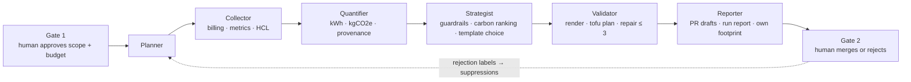

# EmissionGate — agent design document

EmissionGate is an agent that puts the carbon cost of cloud and AI infrastructure into the pull request,
where the engineer who can change it is already looking. It works in two modes on one engine: the
**sweep** finds waste in infrastructure that is running and drafts fix PRs; the **gate** checks every
infrastructure PR before merge and posts its carbon delta with validated lower-carbon suggestions.

This document is organised by the judging brief: goal, user, data sources, tools, orchestration,
decision points, human oversight and failure handling. What is built for this submission and what is
designed only is listed in the [README status table](../README.md#status-built-vs-designed).

Detailed one-page architecture for each mode: [sweep](img/architecture-sweep.png) ·
[gate](img/architecture-gate.png). Diagrams as code: [ARCHITECTURE.md](ARCHITECTURE.md).

---

## 1. Goal

Reduce the operational emissions that infrastructure code commits teams to, by making carbon visible
and actionable **at merge time** instead of in a monthly report.

| Measure of success | How it is measured |
|---|---|
| kgCO2e per year avoided by proposed and merged fixes | deterministic model, [METHODOLOGY.md](METHODOLOGY.md), golden values tested to 3 decimals |
| Correctness on a seeded estate | precision and recall against ground truth; **zero** trap violations |
| Increases caught before merge | gate status per PR (`pass_with_warning`, `ack_required`) |
| The agent's own footprint | energy from CodeCarbon, labelled measured or estimated (estimated on the build laptop: RAM is modelled), kgCO2e per run (SCI, ISO/IEC 21031) and payback ratio |

Non-goals: applying changes, market-based accounting, embodied carbon of cloud hardware, multi-cloud.

## 2. Users

| User | What they do with EmissionGate | Where they meet it |
|---|---|---|
| Platform / infrastructure engineer (primary) | writes and reviews Terraform; reads the carbon delta; commits a suggestion or acknowledges an increase | PR comment and check |
| Repository owner / reviewer | merges or rejects fix PRs; labels rejections so they become rules | GitHub review |
| FinOps or sustainability lead | sets thresholds and guardrails in `policy.yaml`; reads the run report | run report, `policy.yaml` |
| Team lead | approves the scope and budget of a sweep (Gate 1) | CLI approval |

Not a user: anyone who wants a dashboard. EmissionGate deliberately has none; the PR is the interface.

## 3. Data sources

All data is synthetic or public. No customer, confidential or personal data is used.

| Source | Content | Licence / origin | Used by |
|---|---|---|---|
| Synthetic billing (CUR-shaped parquet) | hourly usage and cost, 35 days | generated, seed 42 | Collector |
| Synthetic utilisation series | hourly CPU, GPU, memory per resource | generated, seed 42 | Collector, Quantifier |
| Terraform estate (HCL) | 10 resource groups, one file each | generated; demo repo `emissiongate-demo-estate` | Collector, Validator, gate |
| Cloud Carbon Footprint coefficients | watts per vCPU/GPU, memory, storage, PUE, regional grid factors | Apache-2.0, vendored at pinned commit `f584c549` | Quantifier |
| UK Carbon Intensity API | half-hourly intensity and 48 h forecast, eu-west-2 | CC BY 4.0; committed snapshot as fallback | Quantifier (time shift) |
| `policy.yaml`, `suppressions.yaml` | guardrails, thresholds, human rejections | in repo, edited by humans | Strategist, gate |
| PR plan diff | base vs head `tofu show -json` | the PR under review | gate |

The estate is seeded with real-looking waste **and three traps** (a DR standby, a month-end batch, a
regulatory log bucket) that look like waste but must be refused. See [SYNTHETIC_ESTATE.md](SYNTHETIC_ESTATE.md).

## 4. Tools

| Tool | Purpose | Called by | Side effects and limits |
|---|---|---|---|
| DuckDB | query the billing parquet | Collector | read-only |
| OpenTofu `fmt`, `validate`, `plan`, `show -json` | prove a fix is valid HCL; read a PR's plan | Validator, gate | `-refresh=false`, dummy credentials, providers only from a vetted local mirror — **never touches AWS** |
| Local LLM via Ollama (`gpt-oss:20b`, Apache-2.0) | built: choosing a template's parameters, repairing a failed plan, PR narrative · designed, not built: scan planning, ambiguous classification | Planner, Strategist, Validator | structured JSON only, schema-validated; never produces a number |
| GitHub REST (httpx) | post the gate comment and check; open PRs in live mode | Reporter, Validator | gate: comment + job result only; never pushes or merges |
| CodeCarbon | measure the agent's own energy around the whole run | orchestrator | local measurement; labelled `measured` or `estimated` |
| SQLite ledger | append-only record of every step, tool call and LLM call | everything | `INSERT` only; a trigger rejects updates and deletes |

Absent by design: `tofu apply`, `destroy`, `import`, `state`, and every AWS API call. They are not in the
code, and the coding-agent rules forbid them ([AGENTS.md](../AGENTS.md)).

## 5. Orchestration

A deterministic state machine drives thin agents. Each agent is a function with typed inputs and outputs
([DATA_CONTRACTS.md](DATA_CONTRACTS.md)); the LLM is called only inside the agents that need judgement.

**Sweep mode** runs the whole pipeline on demand (`make demo-offline` or `make demo`) and exits.
Checkpoints after each state make a run resumable; hard budgets cap LLM calls, tokens, repairs, time and
PRs.

**Gate mode** runs in GitHub Actions on every PR that touches `**/*.tf`: a Diff Collector replaces the
Collector (plan of base and head, paired by resource address), the same Quantifier and Strategist
compute the delta and suggestions, the Validator proves each suggestion plans, and the Reporter posts one
comment and sets the check. No LLM runs in CI. Spec: [GATE.md](GATE.md).

The two modes share every component that produces a number, so a figure in a PR comment and a figure
in the run report always agree.

## 6. Decision points

| # | Decision | Made by | Inputs | If it fails or is unsure |
|---|---|---|---|---|
| D1 | Run at all, with what scope and budget | **human** (Gate 1) | estate, budget | run does not start |
| D2 | Is a resource eligible for any change? | deterministic policy | tags, look-back, datapoints, `policy.yaml` | fail closed: blocked or advisory, no diff |
| D3 | Which intervention and which parameters | LLM, choosing only from allowed options | typed facts, allowed template parameters | schema re-ask once, then the rule-based default |
| D4 | Is the rendered change valid? | `tofu plan` exit code | patched HCL | LLM proposes new parameters, ≤ 3 attempts, then escalate to a human |
| D5 | Deliver as PR or escalate | deterministic | validation result, duplicates, budget | escalated draft with the plan error attached |
| D6 | Gate status for a PR | deterministic thresholds (warn 25, acknowledge 100 kgCO2e/yr) | net delta and its range | `not_evaluated` with reason; never a false pass |
| D7 | Accept an increase anyway | **human**: label `eg/carbon-accepted` plus a reason | PR comment | check stays failed until both exist |
| D8 | Merge | **human** (Gate 2) | PR | nothing changes until merged |

The trust boundary: every published number comes from deterministic code in `core/`, which cannot
import the LLM package (enforced by a test). LLM schemas have no numeric fields for energy, carbon or
cost, and PR bodies take every number from the template, with model prose in one narrative slot.

## 7. Human oversight

EmissionGate informs; humans decide.

| Oversight point | Mechanism | Recorded |
|---|---|---|
| Start of a sweep | `--approve` or an interactive confirm; the agent cannot start itself | approver and time in the ledger |
| Every change | delivered as a pull request; the agent has no apply path | PR history |
| Increases above threshold | failing check until a suggestion is committed or a human acknowledges with a reason | label, reason and acknowledger in the ledger |
| Guardrail hits | advisory in the report; no diff is written | ledger |
| Repair exhausted | escalated draft with the plan error | ledger |
| Rejections | `eg/false-positive`, `eg/wrong-fix`, `eg/needs-context` labels become rules in `suppressions.yaml`, editable in git | git history |

Financial, contractual and reputational actions are out of the agent's reach by construction: it cannot
merge, apply, delete or spend.

## 8. Failure handling

| Failure | Detected by | Response | Outcome visible as |
|---|---|---|---|
| Malformed billing partition | schema check | skip it; planner re-plans | reduced coverage in the report |
| Too few metric datapoints | count < `min_datapoints` (500 hourly) | resource excluded | "insufficient data" with count |
| Grid API unreachable | 5 s timeout, 2 retries | committed snapshot, then annual factor | tier stamped on every figure |
| Plan fails | `tofu` exit code | repair ≤ 3, then escalate | recovered or `ESCALATED` |
| LLM returns invalid JSON | pydantic validation | one re-ask, then deterministic path | `fallback` event in the ledger |
| Ollama not running | connection error | whole run continues offline | report says so |
| Guardrail hit | policy check before any decision | no diff written | `BLOCKED` or advisory |
| Budget exhausted | ledger counters | stop at the next checkpoint | `BUDGET_STOPPED`, resumable |
| Ledger write fails | assertion | abort the run | `FAILED` — no unaudited work |
| Gate: plan fails on base or head | exit code | comment "not evaluated" with the error tail | neutral check, never a false pass |
| Gate: resource type not in factors | factor lookup | listed as not quantified | named in the comment, never guessed |
| Gate: suggestion fails to plan | Validator | suggestion dropped | noted in the ledger |

## 9. The agent's own footprint

The hackathon scores the agent's sustainability, so it is measured, not asserted:

- CodeCarbon wraps the whole run, local model included; the report labels energy `measured` or
  `estimated` (on laptops without power counters it is an estimate, and the report says so).
- Reported per run: kWh, kgCO2e (SCI per run), LLM calls, tokens and the payback ratio (kgCO2e/yr the
  run proposed ÷ kgCO2e the run emitted).
- Efficiency choices: deterministic maths, one local open-weight model with low/medium reasoning, fixed
  templates instead of generated code, hard budgets, an offline mode as baseline, no LLM in CI, a local
  provider mirror, nothing deployed.

## 10. Where to read more

[METHODOLOGY.md](METHODOLOGY.md) — formulas, golden values, simplifications ·
[GATE.md](GATE.md) — PR gate · [INTERVENTIONS.md](INTERVENTIONS.md) — fix templates ·
[ARCHITECTURE.md](ARCHITECTURE.md) — state machines, trust boundary, deployment ·
[adr/](adr/README.md) — decisions · [augmentation-log.md](augmentation-log.md) — how AI was used to build it
