# Architecture

EmissionGate is one Python process that reads synthetic billing, utilisation and infrastructure-code
data, computes per-resource energy and emissions deterministically, and delivers reviewable pull
requests. A local open-weight LLM assists with choices, repair and narrative. Two humans gate the flow.

> This document describes the full design. Which parts are built in this submission and which are
> designed only: [README status table](../README.md#status-built-vs-designed).

All diagrams are Mermaid and render on GitHub. The one-page posters are exported to `docs/img/`
(`architecture-overview.png`, `architecture-sweep.png`, `architecture-gate.png`); the Mermaid diagrams are
the detailed, editable versions.

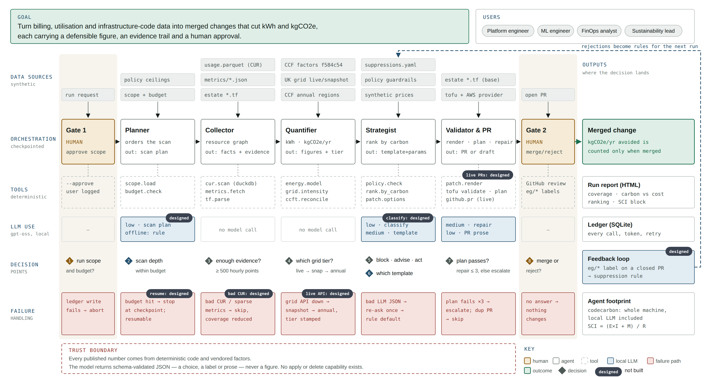

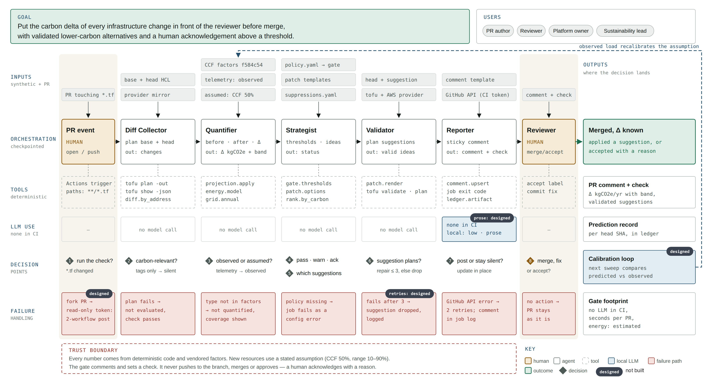

## 1. Context

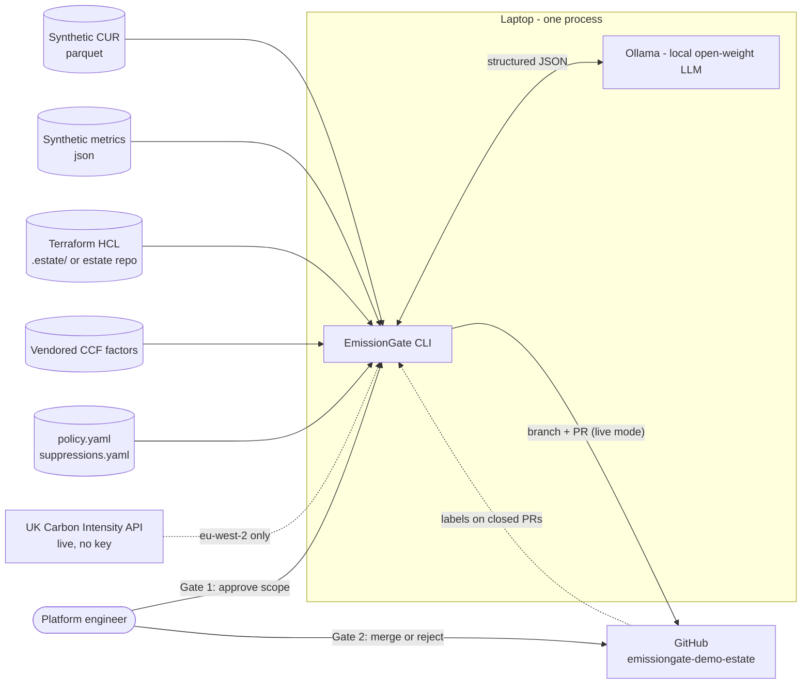

Only two network destinations exist: the UK grid API (optional, falls back to a committed snapshot)
and GitHub (live mode only). The LLM runs on the same machine, so its energy is inside the
`codecarbon` measurement.

## 1b. Two modes, one engine

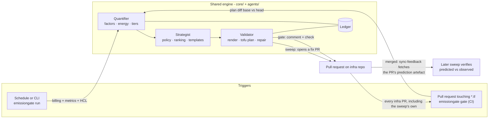

The **sweep** finds waste in what is already running and opens fix PRs. The **gate** checks every
infrastructure PR before merge — a human's or the sweep's — and posts the carbon delta. Details of the gate:
`docs/GATE.md` and §10–§11 below.

## 2. Components

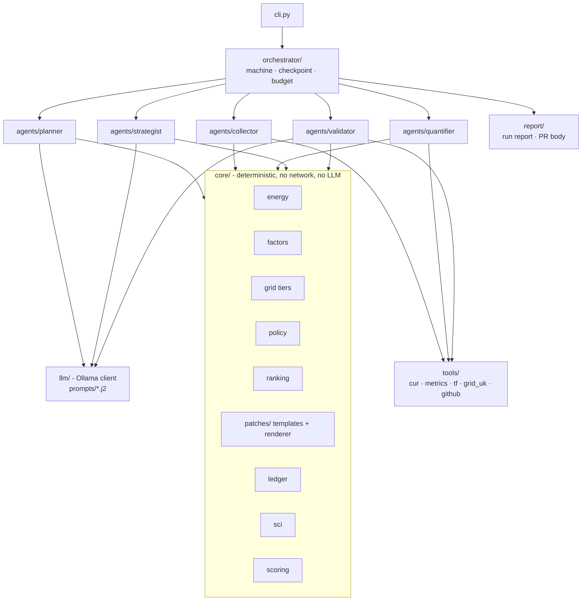

| Component | Owns | Calls LLM | Side effects |
|---|---|---|---|
| Planner | scan order and depth within budget | small, 1 call (offline: rule) | none |
| Collector | resource graph + utilisation summaries | no | reads files |
| Quantifier | kWh, kgCO2e, provenance, CCFT reconciliation | no | reads files; grid API via tools |
| Strategist | candidates, guardrails, ranking, patch decision | small (classify), large (decide) | none |
| Validator | render, `tofu fmt/validate/plan`, bounded repair, PR draft/open | large (repair), small (narrative) | subprocess, GitHub |
| Ledger | append-only audit of everything | — | SQLite write |

## 3. Run-level state machine

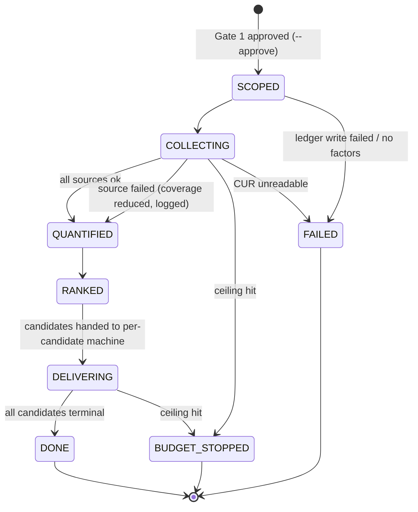

`checkpoint.json` is written **before** each transition. `emissiongate run --resume <run_id>` continues
from the last checkpoint and does not re-spend completed LLM calls.

## 4. Candidate-level state machine

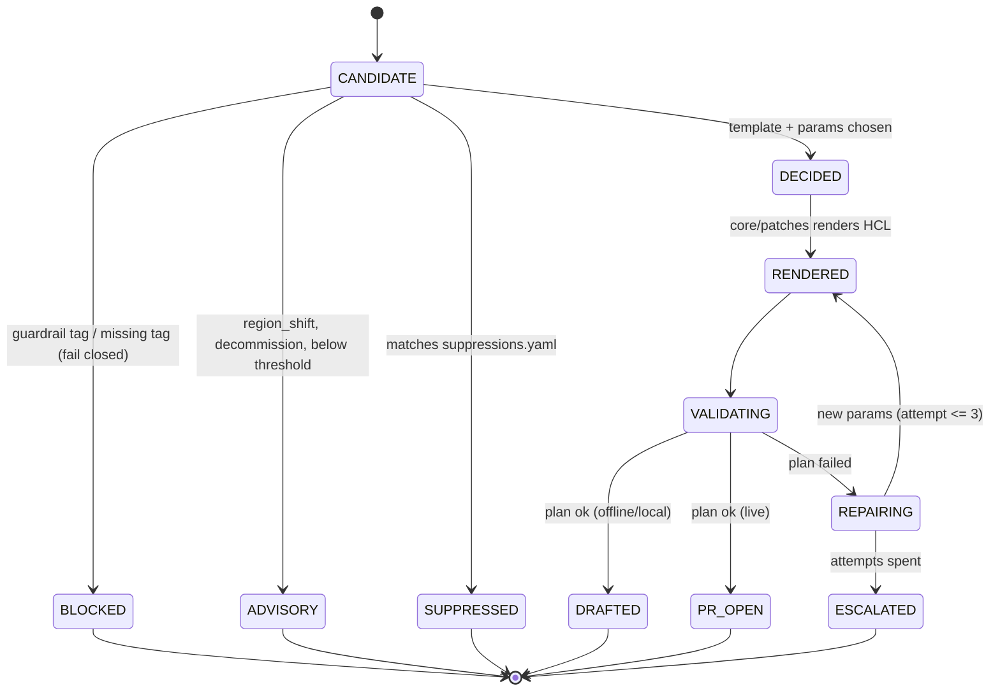

After the run, `emissiongate sync-feedback` observes PRs on GitHub:

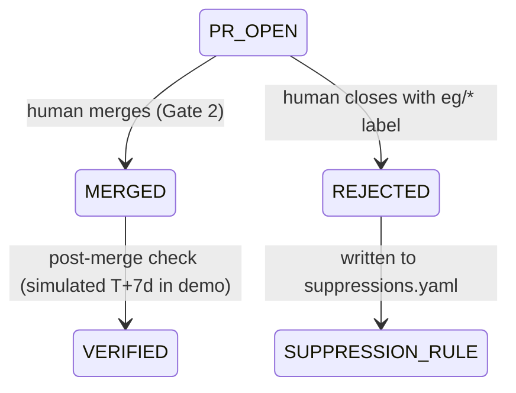

## 5. One candidate, end to end (local/live mode)

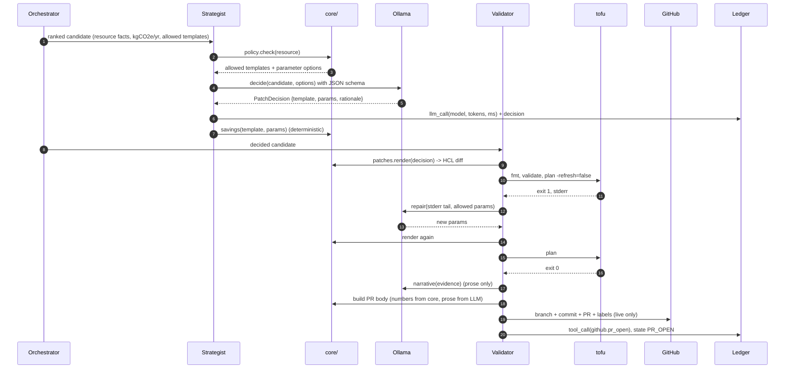

## 6. The trust boundary

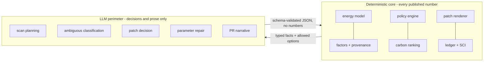

The boundary is enforced three ways: `core/` cannot import `llm/` (test), LLM schemas have no numeric
fields for carbon/energy/cost (contracts), and PR bodies take every number from `core/` via the
template, with LLM prose inserted into a single `narrative` slot.

## 7. Deployment

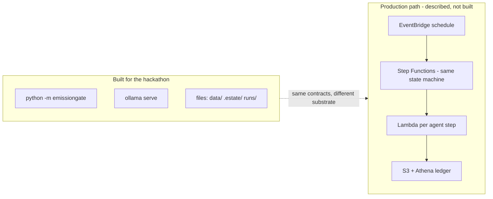

Why nothing is deployed: the agent's own footprint is a judged criterion. A laptop process that runs
for minutes and exits is smaller and more honest than idle cloud infrastructure kept up for a demo
(ADR-0009).

## 8. Human oversight points

| Point | Mechanism | Agent behaviour while waiting |
|---|---|---|
| Gate 1 — scope and budget | `--approve` flag (or interactive confirm); approver + time in ledger | run does not start |
| Gate 2 — merge | GitHub PR review | nothing changes until merged |
| Guardrail escalation | advisory entry in the run report (live: GitHub issue optional) | no PR is written |
| Repair exhausted | draft PR (live) or `ESCALATED` draft with plan error attached | stops after 3 attempts |
| Suppression override | human edits `suppressions.yaml` in git | rule stands until edited |

## 9. Failure handling

| Failure | Detected by | Response | Outcome |
|---|---|---|---|
| CUR partition malformed | schema check on load | skip partition, planner re-plans | coverage reduced, logged |
| Sparse metrics | datapoints < `min_datapoints` | resource marked insufficient | excluded, counted in coverage |
| UK API unreachable | timeout 5s, 2 retries | snapshot, then CCF annual | tier stamped on each figure |
| Plan fails | tofu exit code | repair ≤ 3, then escalate | recovered or `ESCALATED` |
| LLM invalid JSON | pydantic validation | 1 re-ask, then deterministic path | `fallback` event |
| Ollama down | connection error | whole run continues in offline behaviour | report says so |
| Guardrail hit | policy pre-decision | no diff written | `BLOCKED` / advisory |
| Duplicate open PR | GitHub search before open | skip, link existing | no duplicates |
| Budget exhausted | ledger counters | stop at checkpoint | `BUDGET_STOPPED`, resumable |
| Ledger write fails | assertion | abort | `FAILED` |

## 10. Gate mode — one pull request

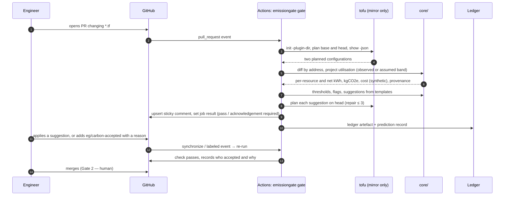

## 11. Gate check states

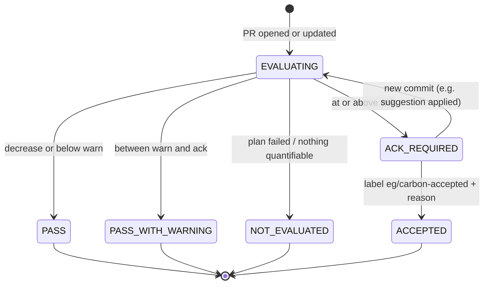

The gate never pushes to the branch and never merges. `ACK_REQUIRED` is a failing check; whether that
blocks merging is the team's branch-protection setting.

