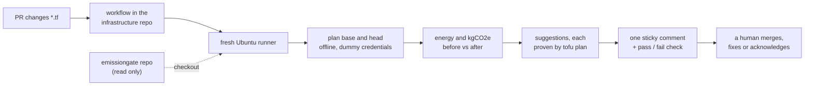

# Using the PR gate — one pull request, step by step, and how another repo adopts it

This page follows one real pull request from the moment it is opened to the carbon comment and check
on it, then explains what another repository needs to use the gate. It is the practical companion to
[GATE.md](GATE.md), the gate's specification. Figures come from
[emissiongate-demo-estate PR #1](https://github.com/MohdJaved01/emissiongate-demo-estate/pull/1) (run of
5 Oct 2026). All infrastructure, telemetry and prices are synthetic.

## Is EmissionGate a service any repo can use?

Almost. It is a **tool that runs in a repository's own CI**, like a linter. It is not a hosted service:
there is no EmissionGate server waiting for requests.

- A repository opts in by adding **one workflow file**. On every matching pull request, that
  repository's own GitHub Actions runner downloads EmissionGate, runs it, and is thrown away.
- Nothing runs in the `emissiongate` repository. Its code is only read.
- Today it handles Terraform or OpenTofu code for AWS, with limits that matter for real repositories:
  see [Adding the gate to another repository](#adding-the-gate-to-another-repository).

## Two repositories, two roles

| Repository | Role | Holds |
|---|---|---|
| [`MohdJaved01/emissiongate-demo-estate`](https://github.com/MohdJaved01/emissiongate-demo-estate) | the infrastructure repo (a fictional company's) | the `.tf` files, the workflow `.github/workflows/emissiongate-gate.yml` (the trigger), the PRs, the comment and the check |
| [`MohdJaved01/emissiongate`](https://github.com/MohdJaved01/emissiongate) (this one) | the engine | the `emissiongate gate` command, carbon factors, policy thresholds, fix templates |

The direction is **pull, not push**: the infrastructure repo's workflow fetches `emissiongate@main` each
time it runs. The workflow's source is [`estate-repo/.github/workflows/emissiongate-gate.yml`](../estate-repo/.github/workflows/emissiongate-gate.yml).



## The run, start to finish

The whole job on PR #1 took about 69 seconds; the carbon check itself took 25.8 seconds.

### Trigger — on GitHub

1. **A developer opens or updates a pull request that changes a `.tf` file.** On PR #1 a developer adds
   an Auto Scaling group of two GPU servers (`g5.2xlarge`) in `gpu_fleet.tf`.
2. **GitHub matches the event to the workflow.** It runs for pull requests, only when a `.tf` file
   changed:

   ```yaml
   on:
     pull_request:
       types: [opened, synchronize, reopened, labeled, unlabeled]
       paths: ["**/*.tf"]
   ```

   `synchronize` means new commits were pushed; `labeled` and `unlabeled` catch the acknowledgement
   label. One run per PR is kept: a newer event cancels an older run that is still going.
3. **GitHub starts a fresh Ubuntu runner** (free for public repositories) with a short-lived
   `GITHUB_TOKEN`. Its permissions are `contents: read`, `pull-requests: write` (the one comment) and
   `issues: read` (the label event and the reason comment). The job has no AWS credentials.

### Setup — on the runner

4. **Check out the infrastructure repo with its full history** (`fetch-depth: 0`), so both `main` (before)
   and the PR branch (after) are available. `persist-credentials: false` keeps the token out of
   `.git/config`, where untrusted PR code could find it.
5. **Check out EmissionGate** from the other repository into `.emissiongate`. It is public, so no key is
   needed. This is the only link between the two repositories.
6. **Install the tools.** Python 3.12 and OpenTofu; the vetted AWS provider is restored from the Actions
   cache (downloaded only on a cache miss); `pip install -e .emissiongate` makes the `emissiongate`
   command available. Planning can use only that one provider, so PR code cannot pull in other plugins.
7. **Make the utilisation data.** The gate needs to know how busy existing servers are. In this demo the
   data is synthetic, generated with the same seed as the estate; no `.tf` files are written:
   `emissiongate estate --telemetry-only --seed 42 --out data`.

### The carbon check — `emissiongate gate`

```bash
emissiongate gate --estate-dir . --base <main commit> --head <PR commit> \
  --pr 1 --repo MohdJaved01/emissiongate-demo-estate --post
```

8. **Screen the PR's code before planning it.** Untrusted HCL is planned only if it cannot reach the
   network or read secrets at plan time: no data sources, no non-local modules, no custom provider
   endpoints, no remote backend, no provider other than AWS, no absolute-path file reads
   (`core/safety.py`). Anything else makes the PR "not evaluated" — a neutral check, never a plan.
9. **Plan both versions.** `tofu plan` on `main` and on the PR head, each turned into JSON. Planning only
   describes what would change; it never creates anything. Plans use `-refresh=false`, the providers
   from the local mirror, and no credentials: tofu's environment is stripped of `AWS_*` and token
   variables, and the estate's provider block uses dummy keys. If either plan fails, the comment says
   "not evaluated" and the check passes as neutral.
10. **Find what changed.** Resources are paired by address and marked added, removed or changed. Only
    energy-relevant settings count: instance type, count and region of Auto Scaling groups (with their
    launch templates and schedules), EC2 instances, RDS instances and EBS volumes. Everything else is
    listed as not carbon-relevant; a tags-only change is no change.
11. **Work out energy and carbon before and after** with the same engine as the sweep: Cloud Carbon
    Footprint watts per vCPU and GPU, memory, data-centre overhead (PUE), then the region's grid
    intensity. Existing resources use their observed utilisation. New resources have no history, so
    they are **assumed** to run at 50% (CCF's default), shown as a 10–90% range.
    *PR #1: 0 → +683.5 kgCO2e/yr (range 263.1–1,103.9, assumed), +1,872 kWh/yr.*
12. **Suggest lower-carbon alternatives and prove them.** The sweep's fix templates (schedule, rightsize,
    Graviton) are applied to the PR's own code. A suggestion is kept only if `tofu plan` passes on it; one
    that fails is dropped and logged. No LLM is involved.
    *PR #1: run the fleet 08:00–20:00 on weekdays with 2 servers, −439.4 kgCO2e/yr (range −709.7 to
    −169.1, assumed). The plan passed.*
13. **Apply the thresholds** in `policy.yaml → gate` to the net change (table below).

### Outcome — back on the PR

14. **Post or update one comment.** The first run creates it; every later run edits the same comment, so
    the PR never fills up with repeats. It shows the net change, a row per resource, the suggestions with
    their diffs, anything it could not quantify, and the check's own footprint.
    *PR #1: "This check ran in 25.8 s; its own energy ≈ 0.383 Wh (estimated, CodeCarbon; hosted runners
    expose no hardware counters)."*
15. **Set the check.** The job's pass or fail is the check on the PR. Whether a red check blocks merging
    is the team's own branch-protection setting. The gate never pushes to the branch, approves or merges.
16. **Keep the evidence.** The run's ledger and prediction are uploaded as an Actions artefact named
    `emissiongate-gate-<PR number>`, kept for 90 days. Then the runner is deleted.

## How the check is decided

| Net change per year | Check | What the human does |
|---|---|---|
| a decrease, or under 25 kgCO2e | ✅ pass | nothing |
| 25 to 100 kgCO2e | ✅ pass with a warning | the reviewer reads the comment |
| 100 kgCO2e or more | ❌ acknowledgement required | commit a suggestion, or comment a reason and add `eg/carbon-accepted` — PR #1 is here, at +683.5 |
| plan failed, or code screened out | ⚪ not evaluated (passes) | nothing; other CI owns syntax errors |
| tags only | no comment | nothing |

## Turning a red check green

1. **Comment** — a reviewer posts the reason, for example "Two-week staging test; we will schedule it
   before production."
2. **Label** — the same person adds `eg/carbon-accepted`. That event re-runs the workflow.
3. **Re-run** — the gate accepts only if a person (not a bot) added the label, the reason comment is by
   that same person, and both are newer than the PR's latest commit. A new push needs a new
   acknowledgement.
4. **Record** — who accepted and why is written to the ledger and shown in the comment.

Order matters in practice. A comment alone does not start a run, so if the label goes on first, the run
finds no reason and stays red until it runs again: remove and re-add the label, or re-run the job from
the Actions page.

## No LLM in the gate

The gate uses **no LLM**: the runner has neither Ollama nor the model, and every figure in the comment is
calculated. The local model (`gpt-oss:20b` via Ollama, on the laptop's CPU) is used only by the sweep in
local mode, to choose a fix's parameters from allowed options (`decide_patch`, medium reasoning), to
repair a failed plan, and to write the PR narrative (`narrative`, low reasoning). It never produces a
published number.

| Mode | LLM | Measured on seed 42 |
|---|---|---|
| `run --mode local` (sweep) | Ollama, `gpt-oss:20b` | 8 calls, 6,624 tokens, ≈ 5.2 Wh per run (estimated) |
| `run --mode offline` (sweep) | none: rules choose, templates write | ≈ 0.36 Wh per run (estimated) |
| `gate` on GitHub | none | 25.8 s, ≈ 0.38 Wh (estimated) |
| `run --mode live` | — | designed, not built: would open real PRs from the sweep |

## When the gate does not run

| Situation | Why |
|---|---|
| The PR changes no `.tf` file | the workflow's `paths` filter skips it |
| Someone only posts a comment | comments are not a trigger event |
| The repository has no workflow file | each repository opts in on its own |
| The PR comes from a fork | it runs, but GitHub gives forks a read-only token, so the comment appears only in the job log. The fix, a second workflow that posts the comment, is designed, not built |

## Adding the gate to another repository

**Steps**

1. Copy [`estate-repo/.github/workflows/emissiongate-gate.yml`](../estate-repo/.github/workflows/emissiongate-gate.yml)
   into the repository's `.github/workflows/`. Nothing changes on the `emissiongate` side.
2. Pin the engine: replace `ref: main` with a commit SHA or tag, so a push to `emissiongate` cannot
   change the gate unannounced.
3. Replace the synthetic-telemetry step with real utilisation, written as
   `data/metrics/<resource-name>.json` (the Terraform name with `-` for `_`) in the format
   `emissiongate estate --telemetry-only` produces. Without it, every changed resource is shown as an
   assumed range.
4. Optionally, require the `gate` check in branch protection, so an unacknowledged increase blocks merge.

**Works today**

- Terraform or OpenTofu for AWS: Auto Scaling groups with launch templates and schedules, EC2
  instances, RDS instances, EBS volumes. New resources are always handled, as an assumed range.
- Same-repository PRs on GitHub-hosted runners.

**Needs work before a real repository can rely on it**

- **Credentials.** Plans run with no credentials. The demo estate's provider block uses dummy keys and
  `skip_*` settings; a provider block that expects real credentials will not plan, so the PR is "not
  evaluated".
- **Real-world HCL.** The safety screen (step 8) refuses data sources, registry or git modules and remote
  backends. Most production repositories use at least one, so they would be "not evaluated" until the
  screen has a safe way to plan them.
- **Provider version.** Only the AWS provider `~> 6.0` from [`tofu/versions.tf`](../tofu/versions.tf) is
  mirrored; other pins fail to initialise.
- **Coverage.** S3, Lambda, EKS and other resource types are listed as not carbon-relevant.
  Only AWS factors are vendored; Azure and Google Cloud need their own factor files.
- **Real utilisation data** (step 3), a **pinned version** (step 2), and the **fork-PR workflow**.
- **Cost figures** are synthetic list prices, labelled as such.

What is built and what is designed only, across the whole project:
[README status table](../README.md#status-built-vs-designed).
